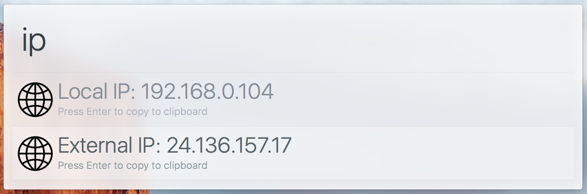

# arvis-ipaddress

> Arvis workflow to display internal/external IP addresses



## Install

```
$ npm install --global arvis-ipaddress
```

## Usage

In arvis, type `ip`, <kbd>Enter</kbd>, and your IP addresses will be displayed.

## License

MIT (c) Steve Agalloco. See [LICENSE](https://github.com/stve/arvis-ipaddress/blob/master/LICENSE.md) for details.
